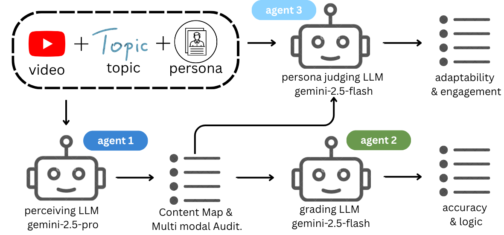

# AI Student — Persona-Aware Educational Video Evaluation

An AI-powered pipeline that evaluates the quality of educational videos from the perspective of diverse student personas, using multi-agent Gemini reasoning and human evaluation tools.



> **Slides**: [Project Presentation](https://docs.google.com/presentation/d/1-pC4ogik8g4J1XsIjHSzUySOt8_fZeqfXZSaU_3GIqk/edit?usp=sharing)

---

## Overview

Given an educational video (YouTube URL or local MP4), the system:

1. **Agent 1 – Content Analyst**: Watches the video (via Gemini VLM) and builds a timestamped content map, flags potential accuracy/logic issues, and identifies teaching mode.
2. **Agent 2 – Gap Analysis Judge**: Reads Agent 1's report and produces objective scores for accuracy and logic.
3. **Agent 3 – Subjective Simulation**: Re-watches the video as a specific student persona, generating a first-person learning experience, engagement curve, and per-persona scores.

Results are saved as JSON per persona and aggregated into a CSV summary. A Streamlit app (`phase_2/human_eval_app.py`) lets human evaluators cross-validate the AI scores.

---

## Repository Structure

```
.
├── asset/
│   └── pipeline.png              # Pipeline diagram
├── persona/
│   └── merged_course_units_with_personas_sub.csv  # Student persona definitions
├── personas.jsonl                # Persona dataset (JSONL)
├── eval_results/                 # Batch evaluation outputs (JSON)
├── phase_2/
│   ├── eval.py                   # Single-video multi-persona evaluation
│   ├── batch_audit_processor.py  # Concurrent multi-video batch evaluation
│   ├── human_eval_app.py         # Streamlit human evaluation interface
│   ├── server.py                 # API server
│   ├── prompts/
│   │   ├── agent1_prompt.md      # Agent 1 system prompt
│   │   ├── agent2_prompt.md      # Agent 2 system prompt
│   │   └── subjective_prompt.md  # Agent 3 system prompt
│   ├── eval_results/             # Per-topic evaluation results
│   ├── merged_small_scale_summaries_20260224_014339.csv
│   ├── human_eval_results.csv    # Human evaluation output
│   └── requirements.txt
└── README.md
```

---

## Quick Start

### 1. Install dependencies

```bash
cd phase_2
pip install -r requirements.txt
```

Set your Gemini API key:

```bash
export GEMINI_API_KEY="YOUR_API_KEY"
```

### 2. Evaluate a single video

```bash
python phase_2/eval.py \
  --url "https://www.youtube.com/watch?v=VIDEO_ID" \
  --title "Topic: Limits and Continuity - Definition and properties of limits" \
  --version version1
```

Outputs per-persona JSON files and a CSV summary under `phase_2/eval_results/<topic>/<video_id>/<version>/`.

### 4. Batch evaluate multiple videos

Create `phase_2/input_videos.json`:

```json
[
  {
    "video_url": "https://www.youtube.com/watch?v=VIDEO_ID",
    "title": "Topic: Chemistry of Life - Structure of water and hydrogen bonding",
    "personas": [
      "Education Level: University | Learning Motivation: Research papers | Timeline Urgency: Urgent",
      "Preferred Explanation Style: Intuition | Focus Level: Medium"
    ]
  }
]
```

Then run:

```bash
cd phase_2
export MAX_CONCURRENT=5   # optional, default 3
python batch_audit_processor.py
```

Results saved to `phase_2/eval_results/concurrent_YYYYMMDD_HHMMSS/`.

### 5. Human evaluation interface

```bash
cd phase_2
streamlit run human_eval_app.py
```

Evaluators log in by name, watch videos, and rate across four dimensions:
- **Accuracy** (objective)
- **Logic** (objective)
- **Adaptability** (per-persona)
- **Engagement** (per-persona)

For local network deployment:

```bash
cd phase_2
./run_human_eval_network.sh
```

---

## Personas

Student personas are defined along dimensions such as education level, learning motivation, preferred explanation style, focus level, depth preference, and timeline urgency. The full persona set is in:

- `persona/merged_course_units_with_personas_sub.csv`
- `personas.jsonl`

---

## Prompts

The three agent prompts are Markdown templates under `phase_2/prompts/` and can be edited directly. See [`phase_2/prompts/README.md`](phase_2/prompts/README.md) for placeholder reference and modification guidelines.

---

## Slides

[Project Presentation (Google Slides)](https://docs.google.com/presentation/d/1-pC4ogik8g4J1XsIjHSzUySOt8_fZeqfXZSaU_3GIqk/edit?usp=sharing)
